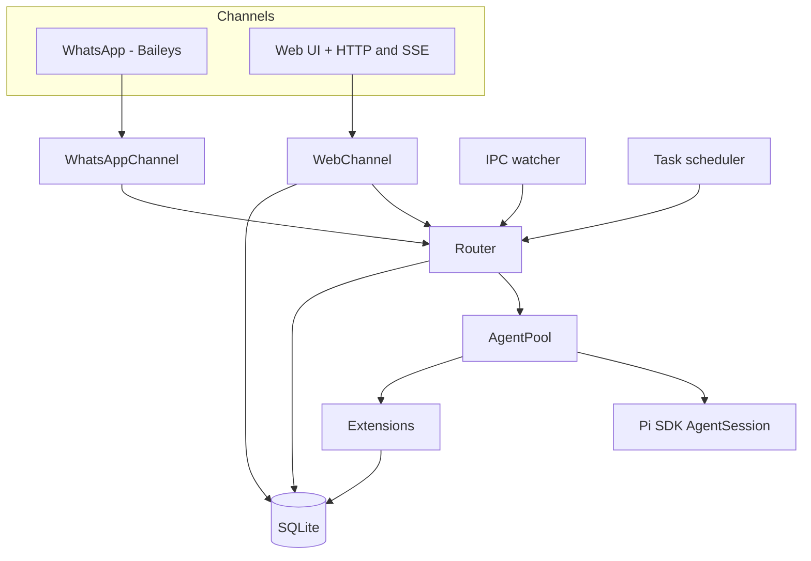

# `piclaw` architecture

This document outlines the main components, how they fit together, and where the code lives.

## Component overview



## Code layout (high level)

```
piclaw/src/
├── index.ts                 # Entry point
├── cli.ts                   # CLI parsing
├── runtime.ts               # Service startup orchestration
├── runtime/                 # Message loop + state management
├── core/                    # Env, config, chat context (AsyncLocalStorage)
├── router.ts                # Message routing
├── queue.ts                 # Agent queue with retry
├── queue/                   # Retry policy
├── agent-pool.ts            # AgentSession pool
├── agent-pool/              # Session helpers, logging, slash commands
├── agent-control/           # Slash command handling + parsers
├── extensions/              # Inline extension factories
├── channels/                # WhatsApp + Web channels
│   └── web/                 # HTTP handlers, SSE, workspace, auth
├── tools/                   # Bash tracking + context wrappers
├── db/                      # SQLite schema + accessors
├── db.ts                    # Legacy DB re-export
├── secure/                  # Keychain (AES-256-GCM)
├── utils/                   # Shared helpers (ids, preview, model utils)
├── workspace-search.ts      # FTS over workspace files
├── task-scheduler.ts        # Cron/interval scheduling
├── tool-output.ts           # Stored tool output management
├── ipc.ts                   # IPC file watcher
└── types.ts                 # Shared type definitions
```

## Extensions

All `piclaw` extensions are shipped as **inline extension factories** — they are compiled into the package and registered via `extensionFactories` on the resource loader. No external files are loaded. The five built-in factories are:

| Factory | Tools / Commands |
|---------|-----------------|
| `fileAttachments` | `attach_file` |
| `messageSearch` | `search_messages` |
| `workspaceSearch` | `search_workspace` |
| `modelControl` | `get_model_state`, `list_models`, `switch_model`, `switch_thinking` |
| `scheduledTasks` | `/tasks`, `/scheduled` slash commands |

Each factory receives an `ExtensionAPI` and registers tools or slash commands via `pi.registerTool()` and `pi.registerSlashCommand()`. System prompt hints are injected via `pi.on("before_agent_start")`.

### Bundled optional extensions (experimental)

In addition to the inline factories, piclaw ships two **optional extensions** under `extensions/` in the package tree. These are loaded via jiti at session start and gated on environment variables:

| Extension | Gate | Purpose |
|-----------|------|---------|
| `azure-openai.ts` | `AOAI_BASE_URL` must be set | Azure OpenAI + Foundry provider with managed-identity or API-key auth |
| `context-mode.ts` | Always loaded | Tool-output storage, search handles, and `batch_exec` tool |

These extensions are **experimental** — their API surface and loading mechanism may change between releases. They use relative imports (`../src/...`) to reference piclaw internals and require a `node_modules` symlink next to the `extensions/` directory (created automatically at startup) for jiti to resolve deep package imports.

## Notes

- The agent pool keeps one warm session per chat JID and evicts idle sessions after a TTL.
- The web UI is the primary interface; the WhatsApp channel is optional.
- Web and WhatsApp share the same storage and agent pool.
- Core utilities (config/env/chat context) live in `src/core`; shared helpers live in `src/utils`.
- Chat context (chat JID + channel) is tracked in AsyncLocalStorage; tools/extensions read from the scoped context (defaults to `web:default` / `web`) rather than env variables.
- Workspace tree responses are cached briefly (1s) and rate-limited to prevent bursty UI reloads (HTTP 429 when exceeded).
- The **workspace explorer** is a responsive sidebar (visible on desktop/tablet ≥1024px landscape) that shows a file tree of `/workspace`, supports file previews, drag-and-drop upload, and file reference pills for prompts.
- The **code editor** (CodeMirror 6) opens from the workspace preview via the pencil icon. It appears as a resizable center pane between the workspace sidebar and the chat. Supports syntax highlighting for 12 languages, search/replace, line wrapping, dirty tracking, and Cmd+S save. The CodeMirror bundle is vendored under `web/static/js/vendor/codemirror.js` (~245 KB gzip). Backend endpoints: `GET /workspace/file?mode=edit` (full content up to 256 KB) and `PUT /workspace/file` (save).
- **Multi-turn threading**: when the agent produces multiple turns in a single response, subsequent turns are stored with a `thread_id` pointing to the first turn's message. The UI renders threaded replies indented with a left border.
- Scheduled tasks are isolated using the **session tree**: before a task runs, the current tree position is saved; after the task, the tree is navigated back. The task's output stays in a side branch without polluting conversation context. If the task uses a different model, it is restored afterwards. See [runtime-flows.md](runtime-flows.md) for details.
- Scheduled tasks validate the requested model at creation time; invalid or ambiguous model names are rejected before the task is persisted.

For the message‑level flow, see [runtime-flows.md](runtime-flows.md).
