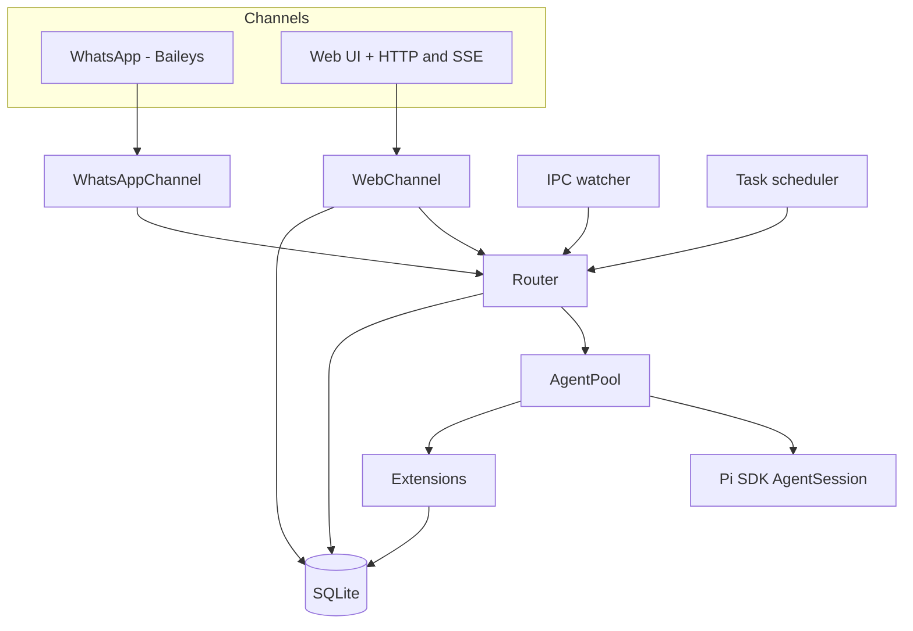

# `piclaw` architecture

This document outlines the main components, how they fit together, and where the code lives.

## Component overview



## Code layout (high level)

```
piclaw/src/
├── index.ts                 # Entry point
├── cli.ts                   # CLI parsing
├── runtime.ts               # Service startup orchestration
├── config.ts                # Env + config.json
├── router.ts                # Message routing
├── agent-pool.ts            # AgentSession pool
├── agent-pool/              # Session helpers
├── agent-control/           # Slash command handling
├── extensions/              # Inline extension factories (attach_file, search_messages, model tools)
├── channels/                # WhatsApp + Web channels
│   └── web/handlers/        # HTTP handlers (agent, posts, media, workspace)
├── tools/                   # Bash tracking + optional context wrappers
├── db/                      # SQLite schema + accessors
└── task-scheduler.ts        # Cron/interval scheduling
```

## Extensions

All `piclaw` extensions are shipped as **inline extension factories** — they are compiled into the package and registered via `extensionFactories` on the resource loader. No external files are loaded. The four built-in factories are:

| Factory | Tools / Commands |
|---------|-----------------|
| `fileAttachments` | `attach_file` |
| `messageSearch` | `search_messages` |
| `modelControl` | `get_model_state`, `list_models`, `switch_model`, `switch_thinking` |
| `scheduledTasks` | `/tasks`, `/scheduled` slash commands |

Each factory receives an `ExtensionAPI` and registers tools or slash commands via `pi.registerTool()` and `pi.registerSlashCommand()`. System prompt hints are injected via `pi.on("before_agent_start")`.

## Notes

- The agent pool keeps one warm session per chat JID and evicts idle sessions after a TTL.
- The web UI is the primary interface; the WhatsApp channel is optional.
- Web and WhatsApp share the same storage and agent pool.
- Chat context (chat JID + channel) is tracked in AsyncLocalStorage; tools/extensions read from the scoped context (defaults to `web:default` / `web`) rather than env variables.
- Workspace tree responses are cached briefly (1s) and rate-limited to prevent bursty UI reloads (HTTP 429 when exceeded).
- The **workspace explorer** is a responsive sidebar (visible on desktop/tablet ≥1024px landscape) that shows an SVG tree of `/workspace`, supports file previews, and lets users attach file reference pills to prompts.
- **Multi-turn threading**: when the agent produces multiple turns in a single response, subsequent turns are stored with a `thread_id` pointing to the first turn's message. The UI renders threaded replies indented with a left border.
- Scheduled tasks are isolated using the **session tree**: before a task runs, the current tree position is saved; after the task, the tree is navigated back. The task's output stays in a side branch without polluting conversation context. If the task uses a different model, it is restored afterwards. See [runtime-flows.md](runtime-flows.md) for details.
- Scheduled tasks validate the requested model at creation time; invalid or ambiguous model names are rejected before the task is persisted.

For the message‑level flow, see [runtime-flows.md](runtime-flows.md).
