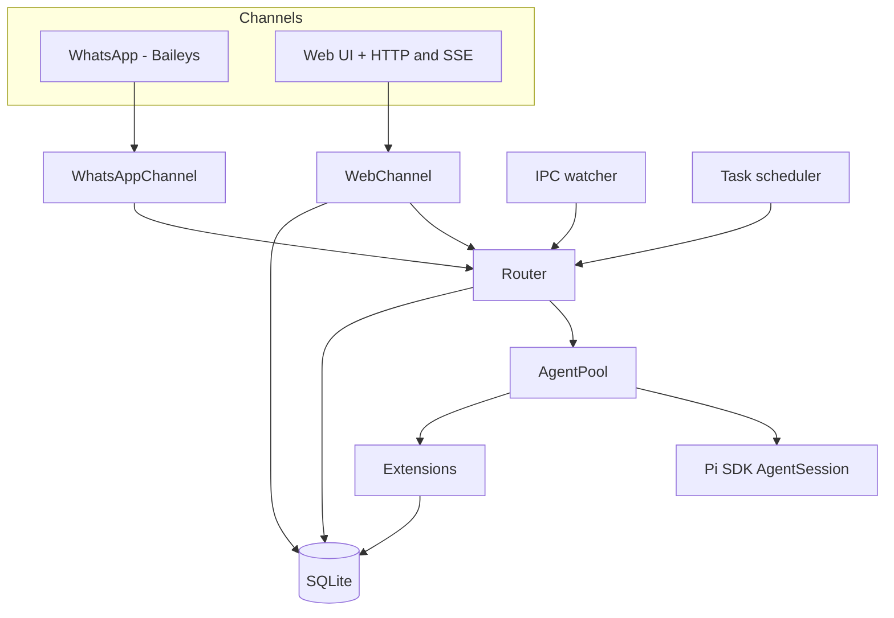

# `piclaw` architecture

This document outlines the main components, how they fit together, and where the code lives.

## Component overview



## Code layout (high level)

```
piclaw/
├── src/
│   ├── index.ts                 # Entry point
│   ├── cli.ts                   # CLI parsing
│   ├── runtime.ts               # Service startup orchestration
│   ├── runtime/                 # Message loop + state management
│   ├── core/                    # Env, config, chat context (AsyncLocalStorage)
│   ├── router.ts                # Message routing
│   ├── queue.ts                 # Agent queue with retry
│   ├── queue/                   # Retry policy
│   ├── agent-pool.ts            # AgentSession pool
│   ├── agent-pool/              # Session helpers, logging, slash commands
│   ├── agent-control/           # Slash command handling + parsers
│   ├── extensions/              # Inline extension factories
│   ├── channels/                # WhatsApp + Web channels
│   │   └── web/                 # HTTP handlers, SSE, workspace, auth
│   ├── tools/                   # Bash tracking + context wrappers
│   ├── db/                      # SQLite schema + accessors
│   ├── db.ts                    # Legacy DB re-export
│   ├── secure/                  # Keychain (AES-256-GCM)
│   ├── utils/                   # Shared helpers (ids, preview, model utils)
│   ├── workspace-search.ts      # FTS over workspace files
│   ├── task-scheduler.ts        # Cron/interval scheduling
│   ├── tool-output.ts           # Stored tool output management
│   ├── ipc.ts                   # IPC file watcher
│   └── types.ts                 # Shared type definitions
├── extensions/                  # Bundled extensions (server + web)
│   ├── azure-openai.ts          # Azure OpenAI/Foundry provider (optional)
│   ├── context-mode.ts          # Tool output + batch_exec extension
│   └── editor/                  # Standalone editor web pane extension
│       ├── editor-extension.ts  # StandaloneEditorInstance + registration
│       └── vendor/              # Vendored CodeMirror bundle
└── web/
    ├── src/
    │   ├── app.ts               # Main Preact app
    │   ├── api.ts               # HTTP/SSE client
    │   ├── components/          # UI components (timeline, compose, etc.)
    │   ├── panes/               # Pane system infrastructure
    │   │   ├── pane-types.ts    # WebPaneExtension contracts
    │   │   ├── pane-registry.ts # PaneRegistry singleton
    │   │   ├── editor-loader.ts # Lazy proxy for editor bundle
    │   │   ├── tab-store.ts     # Framework-agnostic tab state
    │   │   └── terminal-pane.ts # Terminal dock scaffold
    │   ├── ui/                  # Hooks + state management
    │   ├── vendor/              # Vendored libs (preact-htm, mermaid)
    │   └── styles/              # CSS source
    └── static/                  # Served files (HTML, built bundles, icons)
```

## Extensions

### Inline extension factories

These are compiled into the package and registered via `extensionFactories` on the resource loader:

| Factory | Tools / Commands |
|---------|-----------------|
| `fileAttachments` | `attach_file` |
| `messageSearch` | `search_messages`, `get_message` |
| `workspaceSearch` | `search_workspace` |
| `modelControl` | `get_model_state`, `list_models`, `switch_model`, `switch_thinking` |
| `keychainTools` | `keychain` (list, get, set, delete) |
| `scheduledTasks` | `schedule_task`, `/tasks`, `/scheduled` slash commands |
| `sqlIntrospect` | `sql_introspect` (read-only SQLite queries) |
| `internalTools` | `list_internal_tools` |

Each factory receives an `ExtensionAPI` and registers tools or slash commands via `pi.registerTool()` and `pi.registerSlashCommand()`. System prompt hints are injected via `pi.on("before_agent_start")`.

### Bundled optional extensions (experimental)

In addition to the inline factories, piclaw ships **optional extensions** under `extensions/` in the package tree. These are loaded via jiti at session start and gated on environment variables:

| Extension | Gate | Purpose |
|-----------|------|---------|
| `azure-openai.ts` | `AOAI_BASE_URL` must be set | Azure OpenAI + Foundry provider with managed-identity or API-key auth |
| `context-mode.ts` | Always loaded | Tool-output storage, search handles, and `batch_exec` tool |

These extensions are **experimental** — their API surface and loading mechanism may change between releases. They use relative imports (`../src/...`) to reference piclaw internals and require a `node_modules` symlink next to the `extensions/` directory (created automatically at startup) for jiti to resolve deep package imports.

### Web pane extensions

The web UI uses a separate **pane extension** system for content-area components. These are client-side only and live in `extensions/` (editor) or `web/src/panes/` (core infrastructure):

| Extension | Placement | Location |
|-----------|-----------|----------|
| `editor` | tabs | `extensions/editor/editor-extension.ts` |
| `terminal` | dock | `web/src/panes/terminal-pane.ts` (scaffold) |

The editor extension is lazy-loaded as a separate bundle (`editor.bundle.js`, 889 KB) on first file open. See [web-pane-extensions.md](web-pane-extensions.md) for the full contract.

## Web UI loading sequence

```
Page load
  ├── index.html loads:
  │   ├── app.bundle.css (415 KB) ─── all styles
  │   ├── marked.min.js ───────────── markdown parser (global)
  │   ├── katex.min.js ────────────── math rendering (global)
  │   ├── beautiful-mermaid.js ─────── diagram rendering (global)
  │   └── app.bundle.js (185 KB) ──── core app (Preact, timeline, compose, panes)
  │
  ├── app.ts init:
  │   ├── import panes/index.ts
  │   │   ├── pane-types.ts ────────── contracts (types only, zero runtime)
  │   │   ├── pane-registry.ts ─────── PaneRegistry singleton
  │   │   ├── editor-loader.ts ─────── LazyEditorInstance proxy + editorPaneExtension
  │   │   ├── terminal-pane.ts ─────── TerminalPaneExtension (feature-flagged)
  │   │   └── tab-store.ts ────────── TabStore singleton
  │   │
  │   ├── paneRegistry.register(editorPaneExtension) ← loader proxy, NOT real editor
  │   └── paneRegistry.register(terminalPaneExtension) ← if feature flag on
  │
  └── First file opened:
      ├── paneRegistry.resolve({path}) → editorPaneExtension (loader)
      ├── editorPaneExtension.mount(container, context)
      │   └── new LazyEditorInstance()
      │       ├── Shows "Loading..." spinner
      │       ├── import('/static/dist/editor.bundle.js') ← 889 KB, one-time
      │       │   └── exports { StandaloneEditorInstance, editorPaneExtension }
      │       ├── new mod.StandaloneEditorInstance(container, context)
      │       ├── Replays queued callbacks (dirty, save, close, viewState)
      │       └── Removes spinner, editor ready
      └── Subsequent files: editorModuleCache hit, instant mount
```

## Bundle sizes

| Bundle | Size | Contents |
|--------|------|----------|
| `app.bundle.js` | 185 KB | Core app: Preact, timeline, compose box, pane registry, tab store, workspace explorer |
| `editor.bundle.js` | 889 KB | CodeMirror 6 + languages + themes (lazy-loaded) |
| `login.bundle.js` | 2.2 KB | Login page |
| `app.bundle.css` | 415 KB | All styles |

## Notes

- The agent pool keeps one warm session per chat JID and evicts idle sessions after a TTL.
- The web UI is the primary interface; the WhatsApp channel is optional.
- Web and WhatsApp share the same storage and agent pool.
- Core utilities (config/env/chat context) live in `src/core`; shared helpers live in `src/utils`.
- Chat context (chat JID + channel) is tracked in AsyncLocalStorage; tools/extensions read from the scoped context (defaults to `web:default` / `web`) rather than env variables.
- Workspace tree responses are cached briefly (1s) and rate-limited to prevent bursty UI reloads (HTTP 429 when exceeded).
- The **workspace explorer** is a responsive sidebar (visible on desktop/tablet ≥1024px landscape) that shows a file tree of `/workspace`, supports file previews, drag-and-drop upload, inline file creation, inline rename, drag-and-drop move, and file reference pills for prompts.
- The **code editor** is a standalone pane extension (`extensions/editor/`) using CodeMirror 6 directly (no Preact wrapper). It opens in the tabbed content area when a file is clicked in the explorer. Supports syntax highlighting for 12 languages, search/replace, line wrapping, dirty tracking, Cmd+S save, vim mode, whitespace toggle, and accent-aware theming. The editor bundle is lazy-loaded on first file open. Backend endpoints: `GET /workspace/file?mode=edit` (full content up to 256 KB) and `PUT /workspace/file` (save).
- The **tab strip** provides multi-file editing with dirty indicators, pin support, MRU-based tab switching, context menus (Close / Close Others / Close All / Pin / Preview), and keyboard shortcuts (Ctrl+Tab, Ctrl+W).
- **Markdown preview** is available for `.md` / `.mdx` / `.markdown` files via the tab context menu → Preview. Shows a live split-view with a resizable splitter.
- **Message permalinks**: clicking a timeline timestamp inserts a `message:{id}` pill in the compose box; Ctrl+Click copies a shareable URL; clicking a reference scrolls to and highlights the target.
- **Multi-turn threading**: when the agent produces multiple turns in a single response, subsequent turns are stored with a `thread_id` pointing to the first turn's message. The UI renders threaded replies indented with a left border.
- Scheduled tasks are isolated using the **session tree**: before a task runs, the current tree position is saved; after the task, the tree is navigated back. The task's output stays in a side branch without polluting conversation context. If the task uses a different model, it is restored afterwards. See [runtime-flows.md](runtime-flows.md) for details.
- Scheduled tasks validate the requested model at creation time; invalid or ambiguous model names are rejected before the task is persisted.

For the message‑level flow, see [runtime-flows.md](runtime-flows.md).
