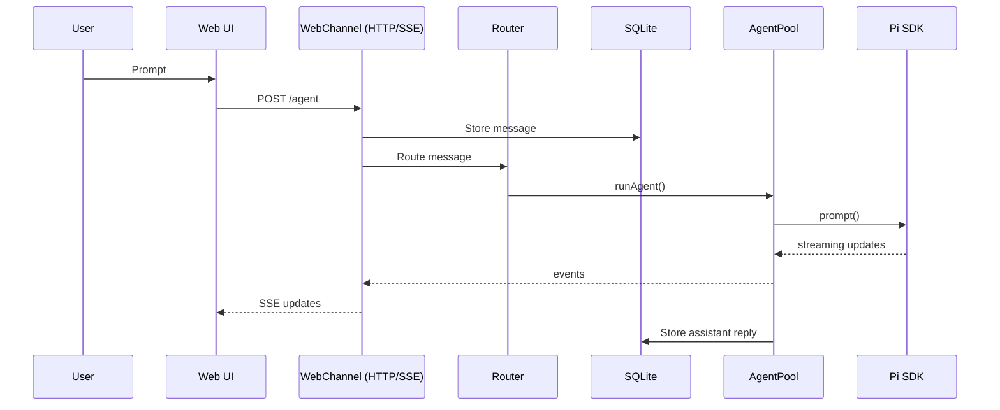
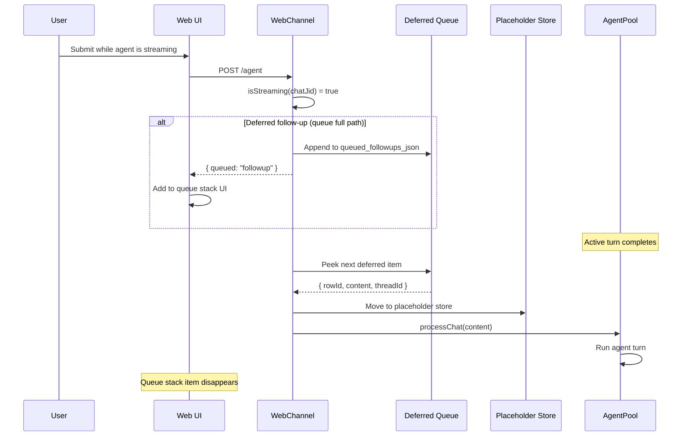
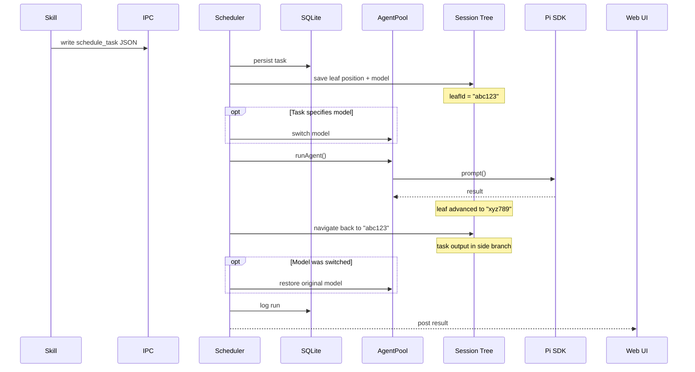
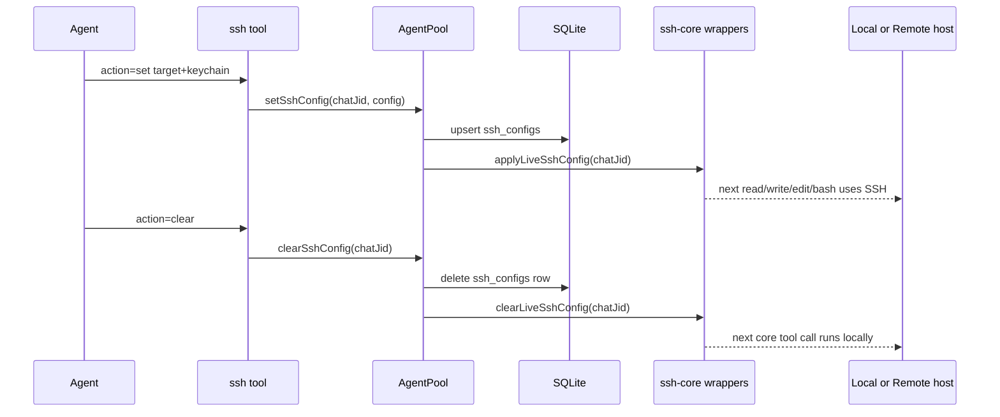

# Runtime flows

This document covers the primary web‑first flows. WhatsApp is documented separately in [whatsapp.md](whatsapp.md).

## Authentication flow (TOTP + passkeys)

The web UI can be gated behind TOTP with optional WebAuthn passkeys. Passkeys are enrolled via the `/passkey enrol` slash command (after signing in with TOTP). The login page attempts passkeys automatically when supported and falls back to the TOTP form if none are available.

- **Initial TOTP setup**: `/totp` → single card with QR + manual code + confirmation input → secret is committed only after successful confirmation
- **Secondary-device setup**: `/totp` with an existing secret re-displays the same secret in the same single-card flow so another authenticator can be validated without rotating the secret
- **Reset**: `/totp reset <current-code>` → verify current code → single card with new QR/manual code + confirmation input → new secret is committed only after successful confirmation, then existing web sessions are invalidated
- **Passkey enrolment**: `/passkey enrol` → one-time link → WebAuthn registration
- **Login**: passkey first (conditional mediation or first input focus), then TOTP fallback
- **Multiple passkeys** are supported per user; manage with `/passkey list` and `/passkey delete`
- Every TOTP card submission returns explicit feedback describing validation success/failure and any changes performed

## Web UI → Agent → Web UI

The web UI supports steering mid‑response by queuing follow‑ups while streaming.



### Follow‑up queueing and steering

When the agent is streaming a response, the user can submit additional messages. These are automatically queued as follow‑ups rather than interrupting the active turn:



There are two queue storage layers:

1. **Deferred Queue** — persisted in `queued_followups_json` column of `chat_cursors`. Uses negative synthetic row IDs. Survives restarts.
2. **Placeholder Store** — in‑memory FIFO (`FollowupPlaceholderStore`). Uses positive real row IDs (from the stored message). Lost on restart but recovered via the deferred queue.

`getQueuedFollowupItems()` merges both stores, deduplicating by `rowId`.

The user can interact with queued items in the compose area:

- **Cancel (×)** — calls `removeAgentQueueItem(rowId)`, which splices the item from the server‑side queue array and broadcasts `agent_followup_removed`.
- **Steer (→)** — calls `steerAgentQueueItem(rowId)`, which injects the item's content as steering into the active agent session. The agent sees it as mid‑turn user input.
- **Move up / move down** — calls `POST /agent/queue-reorder` with `from_index` / `to_index`, which reorders the deferred queue in `queued_followups_json` and persists the new order on the backend instead of leaving the stack at the mercy of timestamp sorting.

Queue reorder now preserves deliberate user ordering all the way through execution:

- the backend control-plane surface exposes `handleAgentQueueReorder()`
- the queued-followup lifecycle service mutates the persisted deferred queue order in place
- the old timestamp-based re-sort that used to quietly undo user moves has been removed

The client tracks a `dismissedQueueRowIdsRef` (Set) to prevent `refreshQueueState` from re‑adding items that were just cancelled or steered. The set is cleared when the agent turn completes or when the server queue empties.

### Turn state machine

Each chat JID has a cursor tracked in `chat_cursors`:

```
IDLE → (beginChatRun) → IN‑FLIGHT → (endChatRun) → IDLE
                                   → (endChatRunWithError) → FAILED
FAILED → (clearFailedRun / next success) → IDLE
```

All state transitions are single SQL statements — crash‑safe under SQLite WAL mode:

- `beginChatRun(chatJid, messageId)` — saves current cursor as `inflight_prev_ts`, records `inflight_message_id` and `inflight_started_at`
- `endChatRun(chatJid, newCursorTs)` — advances cursor, clears inflight + failed markers
- `endChatRunWithError(chatJid, ...)` — records failure metadata, clears inflight marker
- `rollbackInflightRun(chatJid)` — restores cursor from `inflight_prev_ts`, clears inflight marker

If piclaw restarts mid-turn, startup recovery now happens in two phases:
1. inflight web runs are rolled back/cleared immediately on startup
2. once workers and channels are online, piclaw writes a self-addressed `resume_pending` IPC task and resumes any remaining pending chats through the normal IPC path

Recovery logic (`recoverInflightRuns`):
- Finds all `chat_cursors` rows with a non‑null `inflight_message_id`
- If a terminal agent reply already exists past the inflight message → clears the inflight marker (the turn actually completed before the crash)
- If the inflight marker is older than 30 minutes (`MAX_INFLIGHT_AGE_MS`) → clears without rollback (prevents infinite retry of permanently failing messages)
- Otherwise → rolls back the cursor, deletes non‑terminal bot messages after the inflight point, and enqueues a retry through the normal processing path

That keeps restart recovery on the same code path as an explicit reload instead of depending on a lucky post-reboot user action.

### Recovery, timeout, and status breadcrumbs in the web UI

When a turn is recovered and eventually completes, the stored assistant message can carry a `recovery_marker` content block.

The web timeline renders that as a compact `recovered` chip on the post metadata row, with the classifier exposed in the tooltip when available.

When a turn stalls badly enough that the client has to publish a salvaged local fallback, the fallback message can carry a `timeout_marker` content block.

The web timeline renders that as a compact `timeout` chip on the same metadata row, and the fallback body can include the last visible tool action plus the salvaged partial draft.

Separately, the live status surface now keeps more operator-useful context visible:

- active `tool_call` / `tool_status` rows are preserved during silence probing instead of being replaced immediately by generic waiting copy
- recent-activity restore preserves the last meaningful status payload when possible
- tool status rows can show an `x ago` hint in the lower metadata row, alongside git/status metadata

That means the user-facing surface is no longer a silent binary of “worked” vs “mysteriously resumed somehow” — successful recovery leaves a visible breadcrumb, timed-out salvage leaves an explicit breadcrumb, and live status keeps the most recent tool context visible for longer.

## Adaptive Card actions

The web UI can render `adaptive_card` content blocks inline in timeline posts and route card actions back through the normal web channel.

- `Action.OpenUrl` is handled client-side with URL validation and an explicit secondary action button pattern.
- `Action.Submit` posts to `POST /agent/card-action`.
- Submissions are persisted as `adaptive_card_submission` content blocks on the follow-up message.
- The timeline renders those submission blocks as compact receipt-style UI instead of relying on raw fallback text.
- Card lifecycle is tracked on the original card block:
  - default submit behavior: `active → completed`
  - explicit terminal variants can resolve to `cancelled` or `failed`
  - cards with `submit_behavior: "keep_active"` remain interactive after submit
- Completed/cancelled/failed cards are re-rendered from the original card payload with the last submitted values hydrated back into the inputs.
- Finished cards then lock those inputs read-only, hide action buttons, and show a concise theme-consistent status banner rather than echoing the full submission in banner text.
- Validation cards can be posted through the internal `send_adaptive_card` tool, including cases that exercise bad URL handling, submit errors, keep-active cards, and terminal-state transitions.

## Side prompts / Phase 3 groundwork

Piclaw now has a side-prompt primitive for work that should reuse the chat's current model and thinking level without touching the main session tree.

- Backend primitive: `AgentPool.runSidePrompt(chatJid, prompt, options)`
- Web endpoints:
  - `POST /agent/side-prompt` for a one-shot JSON result
  - `POST /agent/side-prompt/stream` for SSE-style `side_prompt_*` events with live thinking/text deltas
- Uses the current chat model + thinking level
- Does not append to the main agent session tree
- Intended as the substrate for future `/btw` / side-conversation UI work

The web UI now has a first thin consumer for this substrate:

- `/btw <question>` is handled locally in the web compose box
- it opens a lightweight side-conversation panel
- the panel streams thinking/text deltas from `POST /agent/side-prompt/stream`
- each BTW run is reseeded from the **current main session tree context** before prompting, so it starts from the active Pi conversation state rather than a cold empty context
- the side run uses a separate side session so it can stay isolated from the main visible conversation while still inheriting current context and model/thinking state
- `Inject into chat` sends the final BTW answer back through the normal message path, so it respects the same queue/follow-up rules as any other user submission

This is still an early web-native BTW layer rather than the full final system, but the separation of concerns is now in place: core provides the side-prompt/side-session substrate, while BTW remains a thin UI consumer on top.

## Context usage / compaction affordance restore

The compose footer exposes current context-window usage through the `ContextPie` indicator, backed by `GET /agent/context`.

The web client now refreshes this state on:
- initial connect
- SSE reconnect
- window focus
- `pageshow`
- `visibilitychange` when the document becomes visible again

That keeps the context compaction affordance in sync when returning to the tab or reopening the webapp, rather than waiting for the slower backstop poller.

The SSE reconnect handler also refreshes queue state (`refreshQueueState()`) so queued follow-ups submitted before a connection gap are restored in the compose stack immediately, rather than waiting for the next 60-second poll cycle.

The persistence model is intentionally split:
- backend truth decides whether the compaction-related affordance is currently warranted
- browser-local state is reserved for lightweight local UI memory such as dismissal/seen state

The web shell now also restores the **last known context usage for the active chat from `localStorage`** before issuing the fresh `/agent/context` request. That gives the footer an immediate post-reload value instead of a brief blank state while the runtime is still waking up.

## Request timing / perf tracing

Hot web paths now emit correlated backend timing and browser-visible request traces.

Backend side:
- request-router and selected web surfaces append `Server-Timing` headers using the `appendServerTiming()` helpers
- the main router also emits an `x-request-id` header so a browser-visible request can be correlated with backend logs or server-side timing spans
- instrumentation is intentionally lightweight: bounded timing metrics attached to normal HTTP responses rather than a full tracing stack

Browser side:
- `runtime/web/src/api.ts` records `x-request-id`, `Server-Timing`, duration, method, URL, and success/failure into `window.__PICLAW_PERF__`
- `runtime/web/src/ui/app-perf-tracing.ts` keeps bounded in-memory trace/request buffers for live inspection in the browser
- failed requests that never receive a response are still recorded as failed-before-response entries so the client-side picture does not quietly omit them

This gives piclaw a cheap request-correlation surface now, while leaving room for a fuller observability/export story later.

## Recent-thread timeline cache / nearby-thread prewarm

The web UI now keeps a bounded cache of recent timeline snapshots and uses nearby-thread prewarming to make thread switches feel less abrupt.

- `app-timeline-cache.ts` stores recent chat timeline payloads with an age limit and a small LRU-style cache cap
- the active chat is excluded from prewarm selection, and recent nearby chats are deduped before background fetches begin
- background prewarm is best-effort: failed fetches are logged at debug level and dropped rather than surfacing as user-facing errors
- the cache is used together with the newer refresh-coalescing/warm-session work so thread switches can often render from something fresher than a cold network round-trip

This is not backend truth — it is browser-local performance state intended purely to reduce visible latency around timeline revisits and nearby-thread navigation.

## Model restore across reloads

Piclaw now persists the active model choice strongly enough that a runtime reload or restart can restore it on the next warm session instead of quietly dropping back to whatever happened to be convenient.

There are two practical consequences:

- post-reload UI state can show the last known model/context footprint immediately from browser-local memory while the backend finishes hydrating
- session-manager/runtime restoration paths reapply the resolved provider/model when the session comes back, so a reload is less likely to feel like a personality transplant

This is especially relevant for web flows that depend on quick restarts or recovery, because the restored model state now survives the same turbulence as the pending-turn recovery path.

## Scheduled tasks / IPC

Scheduled tasks run on the same `AgentSession` as normal user messages but are isolated using the **session tree**. Before executing a task, the scheduler saves the current tree position (leaf ID) and the active model. The task's prompt and response are appended to the session as usual, then the scheduler **navigates back** to the saved leaf. This leaves the task's output in a side branch of the session tree — it persists in history but does not pollute the user's conversation context.

If the task specifies a different model (e.g. a cheaper one for periodic summaries), the model is switched before execution and restored afterwards. Because the tree navigation also rewinds the conversation state, the model restore happens on the original branch where it belongs.



### Why session tree isolation matters

Without isolation, a scheduled task's prompt and response would appear in the agent's conversation context. The next user message would see the task's output, leading to confused responses. The session tree approach solves this cleanly:

- **No context pollution**: The user's conversation continues from where it left off.
- **Full history**: The task's output is preserved in a side branch and can be inspected via `/tree`.
- **Model safety**: The model is restored to its pre-task state on the correct branch.
- **No session forking**: Unlike `fork()` which creates a new session file, `navigateTree()` stays in the same file and simply moves the branch pointer.

## Session-scoped SSH remote tools

A chat can optionally switch its core file/shell tools to a remote host over SSH.

- Control surface: agent-only `ssh` tool
- Scope: one chat JID at a time
- Persistence: SQLite `ssh_configs`
- Affected tools: `read`, `write`, `edit`, `bash`

The important runtime property is that SSH mode is **live mutable**. If a warm session already exists, `ssh set` and `ssh clear` can flip the backend immediately for the next tool/model step without rebuilding the whole session.



Transport semantics match the packaged SSH extension model:

- multiplexed connection reuse
- `ControlMaster=auto`
- `ControlPersist=600`
- persistent remote shell state
- configured remote cwd/home mapping

## Context conservation and tool discoverability

Several runtime choices are intentionally optimized for low-context turns and progressive discovery:

- small fixed tool baseline, plus automatic default activation for safe read-only tools and message/scheduling/attachment helpers in the current catalog, with explicit same-turn tool activation for everything else
- session-scoped infra profiles so SSH / Proxmox / Portainer state can be reused without restating connection details every turn
- compact `capabilities` output and short `recommend` results before full workflow details
- opt-in examples in `workflow_help` instead of returning bulky example payloads by default
- warm session reuse so model state and scoped tool state stay available without repeated setup

For infrastructure work, the preferred discovery path is:

`discover` → `capabilities` or `recommend` → `workflow_help` → `workflow`

For internal tools, the parallel staged path is:

`list_tools(query)` → compact summaries → on-demand parameters/details → `activate_tools` / use

Only fall back to raw `request` when the curated workflow surface is not the right fit.

## Session lifecycle (summary)

- Messages for a chat JID share a warm `AgentSession`.
- Auto‑compaction runs when the context window is tight.
- Idle sessions are evicted after a short TTL (default: 3 min main, 1 min side).
- Memory pressure mode activates above 512 MB RSS (default), shrinking the main-session pool to 1 and dropping the main idle TTL to 60 s.
- When the agent produces multiple turns in a single response (e.g. tool calls followed by a final answer), each turn’s text and attachments are stored as separate messages. The first becomes the thread root; subsequent turns carry a `thread_id` pointing back to the root. The UI renders these as indented threaded replies.

### Stuck-session escalation

When a session produces **two consecutive empty responses** (0 output chars, `stopReason: stop`) for real user messages, the runtime escalates from a silent no-op cursor advance to a **recovery-stalled card**:

- The first empty response: logged as `process_chat.no_output_noop`, a warning message is stored, and the cursor advances (handles benign restart-replay edge cases).
- The second consecutive empty response for the same chat: escalates to `process_chat.no_output_escalated`. `endChatRunWithError` is called (cursor does **not** advance), and the recovery card is posted offering `/compact` and `/new-session` options.

On the web client, a separate salvage path also exists for stalled in-flight turns with partial draft text:

- keep the last draft visible in the draft panel
- preserve the last visible tool action when available
- append a local fallback timeline post with a visible `timeout` marker

This prevents the infinite loop seen with oversized session files (≥10 MB JSONL) on the Azure Responses API, while also giving the user a more useful failure surface when the model stopped mid-answer.

See [architecture.md](architecture.md) for component layout and [tools-and-skills.md](tools-and-skills.md) for tool/skill details.
