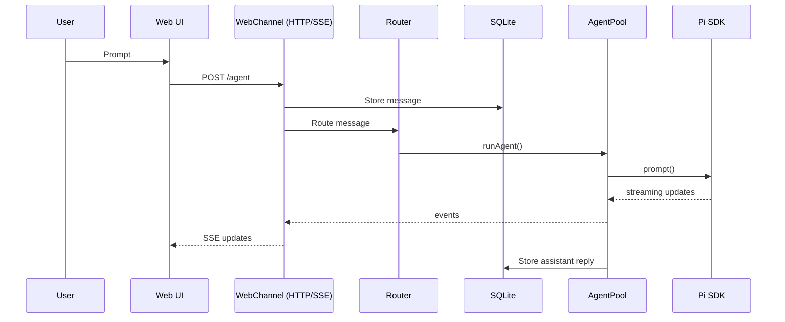
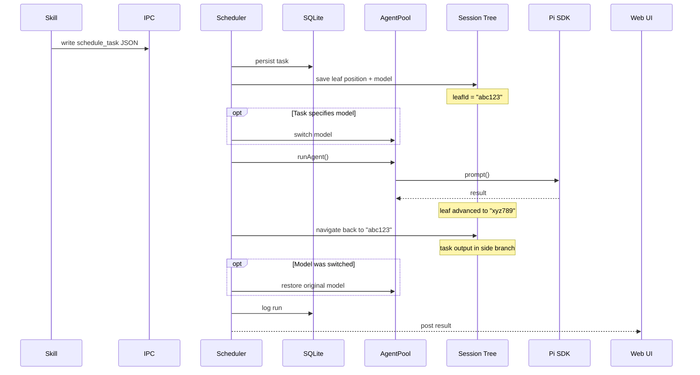

# Runtime flows

This document covers the primary web‑first flows. WhatsApp is documented separately in [whatsapp.md](whatsapp.md).

## Web UI → Agent → Web UI

The web UI supports steering mid‑response by queuing follow‑ups while streaming.

## Scheduled tasks / IPC

Scheduled tasks run on the same `AgentSession` as normal user messages but are isolated using the **session tree**. Before executing a task, the scheduler saves the current tree position (leaf ID) and the active model. The task's prompt and response are appended to the session as usual, then the scheduler **navigates back** to the saved leaf. This leaves the task's output in a side branch of the session tree — it persists in history but does not pollute the user's conversation context.

If the task specifies a different model (e.g. a cheaper one for periodic summaries), the model is switched before execution and restored afterwards. Because the tree navigation also rewinds the conversation state, the model restore happens on the original branch where it belongs.

### Why session tree isolation matters

Without isolation, a scheduled task's prompt and response would appear in the agent's conversation context. The next user message would see the task's output, leading to confused responses. The session tree approach solves this cleanly:

- **No context pollution**: The user's conversation continues from where it left off.
- **Full history**: The task's output is preserved in a side branch and can be inspected via `/tree`.
- **Model safety**: The model is restored to its pre-task state on the correct branch.
- **No session forking**: Unlike `fork()` which creates a new session file, `navigateTree()` stays in the same file and simply moves the branch pointer.

## Session lifecycle (summary)

- Messages for a chat JID share a warm `AgentSession`.
- Auto‑compaction runs when the context window is tight.
- Idle sessions are evicted after a short TTL.
- When the agent produces multiple turns in a single response (e.g. tool calls followed by a final answer), each turn's text and attachments are stored as separate messages. The first becomes the thread root; subsequent turns carry a `thread_id` pointing back to the root. The UI renders these as indented threaded replies.

See [architecture.md](architecture.md) for component layout and [tools-and-skills.md](tools-and-skills.md) for tool/skill details.
