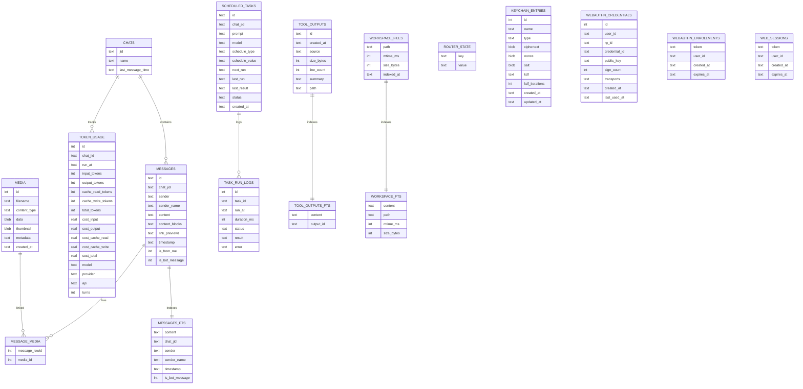

# Storage model

`piclaw` stores state in SQLite at `/workspace/.piclaw/store/messages.db`. The database is the source of truth for chat history, media, tasks, and token usage.

**Never delete this file.** Only repair or migrate it.

## Key tables

| Table | Purpose |
|-------|---------|
| `chats` | Known chat JIDs and metadata |
| `messages` | Message history |
| `messages_fts` | Full‑text search index |
| `media` | Attachment blobs |
| `message_media` | Message ↔ media join |
| `scheduled_tasks` | Task definitions |
| `task_run_logs` | Task run history |
| `token_usage` | Per‑assistant‑message token + cost usage |
| `tool_outputs` | Stored tool output summaries |
| `tool_outputs_fts` | Full‑text index for tool output |
| `workspace_files` | Indexed workspace files (path, size, mtime) |
| `workspace_fts` | Full‑text index for workspace content |
| `router_state` | Polling cursors |
| `keychain_entries` | Encrypted secrets for tool env injection |
| `webauthn_credentials` | Stored passkeys (credential public keys + counters) |
| `webauthn_enrollments` | One‑time enrolment tokens for passkey registration |
| `web_sessions` | Persistent web UI sessions (TOTP + passkey logins) |

Attachments and link previews are stored on the message record (`content_blocks`, `link_previews`).

## Entity map



## Token usage

`token_usage` stores per-assistant-message usage and cost tracking:

- `run_at` is the timestamp for the tool run (ISO 8601).
- Token counts are stored in `input_tokens`, `output_tokens`, `cache_read_tokens`, `cache_write_tokens`, and `total_tokens`.
- Costs are tracked in `cost_input`, `cost_output`, `cost_cache_read`, `cost_cache_write`, and `cost_total`.
- `model`, `provider`, and `api` help with attribution.

## Indexes

- `messages(timestamp)` for chronological queries
- `messages(chat_jid)` for timeline paging
- `messages(chat_jid, timestamp)` for per-chat time windows
- `messages(chat_jid, is_bot_message, timestamp)` for pollers and ingestion
- `token_usage(chat_jid)`, `token_usage(run_at)`, and `token_usage(chat_jid, run_at)` for usage summaries
- `chats(last_message_time)` for recent chat ordering
- `scheduled_tasks(next_run)`, `scheduled_tasks(status)`, `scheduled_tasks(created_at)`, and `scheduled_tasks(last_run)` for the scheduler
- `task_run_logs(task_id, run_at)` for audit history
- `tool_outputs(created_at)` for recent tool output
- `media(created_at)` for attachment timelines
- `message_media(message_rowid)` and `message_media(media_id)` for joins
- `messages_fts`, `tool_outputs_fts`, and `workspace_fts` for full-text search
- `keychain_entries(type)` for keychain lookups
- `webauthn_credentials(user_id)` and `webauthn_credentials(rp_id)` for passkey queries
- `webauthn_enrollments(expires_at)` for enrolment cleanup
- `web_sessions(expires_at)` for session cleanup

## Data paths

- `/workspace/.piclaw/store/messages.db` — SQLite database
- `/workspace/.piclaw/data/sessions/` — `pi` session JSONL history
- `/workspace/.piclaw/data/ipc/` — IPC messages and scheduled task files
- `/workspace/.piclaw/data/chats.json` — Known chat JIDs

## Backups

Restic snapshots are stored in the configured repository. The backup script lives at:

```
/workspace/.piclaw/restic/backup.sh
```
