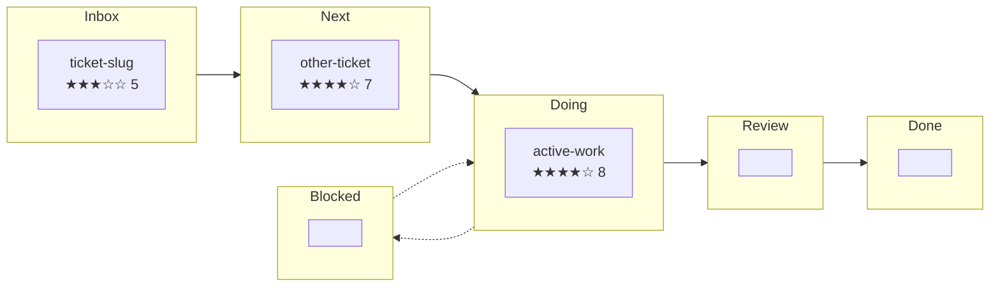

# Kanban Management Skill

Activate this skill when the user asks to create, triage, refine, score, or
move kanban tickets — or when asked to review the board and propose next actions.

---

## 1. Board Layout

| Lane | Path | Purpose |
|---|---|---|
| Inbox | `kanban/00-inbox/` | Raw ideas, bug reports, unstructured requests |
| Next | `kanban/10-next/` | Refined, ready to pick up |
| Doing | `kanban/20-doing/` | Actively in progress (limit ≤ 3) |
| Blocked | `kanban/30-blocked/` | Has explicit `## Blockers` section |
| Review | `kanban/40-review/` | Implementation done, needs verification |
| Done | `kanban/50-done/` | Verified complete |
| Template | `kanban/_templates/work-item.md` | Copy for new tickets |

## 2. Ticket File Format

- Filename: `kebab-case-slug.md`
- YAML front matter (required fields marked with `*`):

```yaml
---
id*: kebab-case-slug
title*: Human-readable title
status*: inbox | next | doing | blocked | review | done
priority: low | medium | high | critical
created*: YYYY-MM-DD
updated*: YYYY-MM-DD
completed: YYYY-MM-DD          # set when moved to done
target_release: next | vX.Y.Z
estimate: S | M | L | XL
risk: low | medium | high
tags: [work-item, kanban, ...]
owner: pi
---
```

- Body sections (in order):
  1. `# Title`
  2. `## Summary`
  3. `## Blockers` (if status=blocked)
  4. `## Acceptance Criteria`
  5. `## Implementation Paths`
  6. `## Test Plan`
  7. `## Definition of Done`
  8. `## Updates` (reverse-chronological date headers)
  9. `## Notes`
  10. `## Links`

---

## 3. Development Flows

### A) Ideation → Ticket

When a request is vague or exploratory:

1. Create ticket in `00-inbox/` with summary and rough acceptance criteria.
2. Ask clarifying questions or make assumptions explicit in `## Notes`.
3. Split large ideas into ≤ 3 follow-up tickets with explicit dependencies.
4. When refined enough, move to `10-next/` and set `priority` + `estimate`.

### B) Refinement → Ready

Before a ticket moves from `next` to `doing`:

1. Expand `## Acceptance Criteria` into testable statements.
2. Add `## Implementation Paths` with at least two options (A = recommended, B = alternative).
3. Add `## Test Plan` covering:
   - unit tests (file paths or describe blocks)
   - integration/E2E (manual steps or harness commands)
   - production validation steps
4. Add `## Definition of Done` checklist (see §5 below).
5. Set `estimate` and `risk`.
6. Ensure all `## Blockers` are resolved or tracked.

### C) Implementation → Review

While a ticket is in `doing`:

1. Create a **feature branch** named after the ticket slug (e.g., `feature/message-permalink-references`).
   All implementation work for the ticket MUST happen on this branch, not on `main`.
2. Log progress under `## Updates` with dated entries.
3. Reference commit hashes, test results, and artifact paths.
4. When implementation is complete:
   - Run test plan; record pass/fail evidence.
   - Merge the feature branch to `main` (fast-forward or squash).
   - Move ticket to `40-review/`.
   - Set `updated` date.

### D) Review → Done

1. Verify acceptance criteria against evidence in `## Updates`.
2. Check `## Definition of Done` checklist is fully ticked.
3. Add retrospective: `## Implementation Paths Considered (historical)`.
4. Set `completed` date, move to `50-done/`.

### E) Blocking and Unblocking

- When blocked: move to `30-blocked/`, add `## Blockers` with file paths to blocker tickets.
- When unblocked: remove resolved blockers, move back to previous lane, log in `## Updates`.
- Never move a blocked ticket to `doing` without clearing all blockers.

---

## 4. Update History Process

Every ticket modification must leave an audit trail in `## Updates`.

### What triggers an update entry

| Event | Required entry content |
|---|---|
| Ticket created | Initial creation note |
| Lane change | Old lane → new lane, reason |
| Acceptance criteria changed | What was added/removed/reworded |
| Implementation path chosen | Which path and why |
| Code committed | Commit hash, files touched, test result summary |
| Test run completed | Command, pass/fail counts, artifact paths |
| Blocker added or resolved | Blocker ticket path, resolution summary |
| Scope change | What was added/deferred, rationale |
| Quality score assessed | Score breakdown and verdict |
| Review feedback | What passed, what needs rework |
| Ticket completed | Completion evidence summary |

### Entry format

```md
### YYYY-MM-DD
- <lane change, if any>
- <what changed and why>
- <evidence: commit hash, test output, artifact path>
- Quality score: X/10 (problem: N, scope: N, test: N, deps: N, risk: N)
```

Use star emojis in reports and update entries:
- `★★★★★` = 9–10, `★★★★☆` = 7–8, `★★★☆☆` = 5–6, `★★☆☆☆` = 3–4, `★☆☆☆☆` = 0–2

### Rules

- Entries are reverse-chronological (newest first under `## Updates`).
- Always update the `updated:` front matter field to match.
- Never delete or rewrite history — append corrections as new entries.
- Reference concrete artifacts (file paths, commit hashes, report files) — not vague summaries.
- When moving lanes, the update entry must state the source and target lane.

---

## 5. Quality Readiness Score

Score each active ticket (not inbox, not done) on five dimensions, 0–2 each:

| Dimension | 0 | 1 | 2 |
|---|---|---|---|
| **Problem clarity** | no user value stated | value implied | explicit outcome with context |
| **Scope** | unbounded | partial boundaries | clear scope, non-goals listed |
| **Testability** | no criteria | vague criteria | measurable acceptance criteria |
| **Dependencies** | unknown | partially mapped | all blockers/links captured |
| **Risk coverage** | none | risks listed | risks + mitigations documented |

Total: `/10`, displayed as star rating in reports.

### Star rating scale

| Score | Stars | Verdict |
|---|---|---|
| 0–2 | ★☆☆☆☆ | Not ready — major gaps |
| 3–4 | ★★☆☆☆ | Not ready — needs refinement |
| 5–6 | ★★★☆☆ | Workable — known gaps remain |
| 7–8 | ★★★★☆ | Good — minor items only |
| 9–10 | ★★★★★ | Ready — pick up and execute |

### When to score

- On creation (baseline score).
- Before moving `next → doing` (gate: must be ≥ 5).
- After any scope or criteria change (re-score and log delta).
- During board review (score all active tickets).

### How to record

Add a quality score line to the latest `## Updates` entry:

```md
### 2026-03-11
- Quality: ★★★★☆ 7/10 (problem: 2, scope: 1, test: 2, deps: 1, risk: 1)
- Gap: scope boundaries need non-goals section; dependency on X not yet tracked.
```

### Quality gates by lane transition

| Transition | Minimum | Stars | Additional requirement |
|---|---|---|---|
| inbox → next | 3 | ★★☆☆☆ | Summary + rough acceptance criteria |
| next → doing | 5 | ★★★☆☆ | Implementation paths + test plan + DoD checklist |
| doing → review | 7 | ★★★★☆ | All tests passing, update history current, test gate met |
| review → done | 9 | ★★★★★ | DoD fully checked, no open gaps |
| any → blocked | n/a | — | Blockers section with ticket links |

### Test coverage gate

Every ticket that introduces or modifies code **must** pass a test gate before
moving from `doing → review`. The gate requirements scale with risk:

| Change type | Minimum test requirement |
|---|---|
| New module / contract / interface | Unit tests for all public API surface (registry, resolution, lifecycle) |
| Bug fix | Regression test reproducing the bug before fix, passing after |
| Refactor (behavior-preserving) | Existing tests still pass; add tests if uncovered paths are touched |
| UI-only (CSS / template) | Manual test noted in `## Updates` with browser + device |
| Config / docs only | No test required |

**Concrete checklist** (add to `## Test Plan` in every implementation ticket):

```md
## Test Plan

- [ ] Unit tests written for new/changed logic (file paths or describe blocks listed)
- [ ] All existing tests pass (`bun run test`)
- [ ] Type check clean (`bun run typecheck`)
- [ ] Edge cases and error paths covered (invalid input, exceptions, empty state)
- [ ] Test evidence recorded in `## Updates` (commit hash, pass/fail count)
```

A ticket **cannot** transition `doing → review` if:
- It introduces new logic without corresponding test files.
- Existing tests are broken by the changes.
- The `## Updates` entry for the transition does not include test evidence.

---

## 6. Definition of Done Checklist

Every implementation ticket must include this checklist (copy into `## Definition of Done`):

```md
## Definition of Done

- [ ] All acceptance criteria satisfied and verified
- [ ] Tests added or updated — passing locally (`bun run test`)
- [ ] Type check clean (`bun run typecheck`)
- [ ] Docs and notes updated with links to ticket
- [ ] Operational impact assessed (config changes, migrations, restarts)
- [ ] Follow-up tickets created for deferred scope
- [ ] Update history complete with evidence
- [ ] Quality score ≥ 9 recorded in final update
- [ ] Ticket front matter updated (`status`, `updated`, `completed`)
- [ ] Ticket moved to `50-done/`
```

---

## 7. Board Review Report

When asked to review the board, produce:

### Summary table

| Ticket | Lane | Priority | Quality | Blockers | Estimate | History entries | Next Action |
|---|---|---|---|---|---|---|---|

Use star emojis in the Quality column: `★★★★☆ 7/10`.

### Quality audit

For each active ticket, verify:
- Latest `## Updates` entry is current (not stale).
- Quality score recorded and ≥ minimum for current lane.
- Flag tickets that fail lane quality gates.

### Health metrics

- **WIP**: count of tickets in `doing` (flag if > 3)
- **Blocked**: count and list of blocker chains
- **Stale**: tickets with `updated` > 7 days ago
- **Inbox backlog**: count of unrefined items
- **Missing quality scores**: tickets without a recorded score
- **Gate violations**: tickets in lanes above their score threshold

### Recommended execution order

Numbered list of tickets to pick up next, based on:
1. Unblock chains (resolve blockers first)
2. Priority × readiness score
3. Smallest-viable-slice preference

---

## 8. Ticket Expansion Template

When refining a ticket, use this structure:

```md
## Implementation Paths

### Path A — <label> (recommended)
1. <step>
2. <step>

**Pros:** ...
**Cons:** ...

### Path B — <label>
1. <step>
2. <step>

**Pros:** ...
**Cons:** ...

## Recommended Path

<one-sentence justification>

## Test Plan

- **Unit:** `test/path/to.test.ts` — <what to cover>
- **Integration:** <harness command or manual steps>
- **Production:** <validation on live instance>

## Risks and Mitigations

| Risk | Impact | Mitigation |
|---|---|---|
| ... | ... | ... |
```

---

## 9. Board Visualisation

When asked to render the kanban board, use a Mermaid `graph LR` flowchart with
subgraphs for each lane.  The bundled Mermaid version does **not** support
`kanban`, `block-beta`, or YAML front matter headers — stick to classic
`graph`/`flowchart` syntax.



- Each ticket node: `["slug<br/>★★★☆☆ score"]`
- Empty lanes: use a space placeholder `[" "]` to keep the subgraph visible.
- Priority: append `🔴` (critical), `🟠` (high), `🟡` (medium), or `⚪` (low) after the score.

---

## 10. Useful Commands

```bash
# Full inventory
find kanban -maxdepth 2 -type f -name '*.md' ! -path '*/_templates/*' | sort

# Dependency graph
rg -n "## Blockers|blocker|gated" kanban -S

# Stale ticket check
find kanban/10-next kanban/20-doing kanban/30-blocked -name '*.md' \
  -exec grep -l "updated: $(date -d '-7 days' +%F 2>/dev/null || date -v-7d +%F)" {} \;

# Front matter audit
rg -n "^status:|^priority:|^estimate:|^risk:" kanban -S
```

---

## 11. Guardrails

- Do not claim completion without test evidence.
- Do not skip `## Test Plan` for implementation tickets.
- Do not move blocked tickets without clearing blockers.
- Prefer small tickets (S/M) with dependencies over XL monoliths.
- Always update `updated` date when modifying a ticket.
- Keep implementation paths codebase-specific (reference real file paths).
